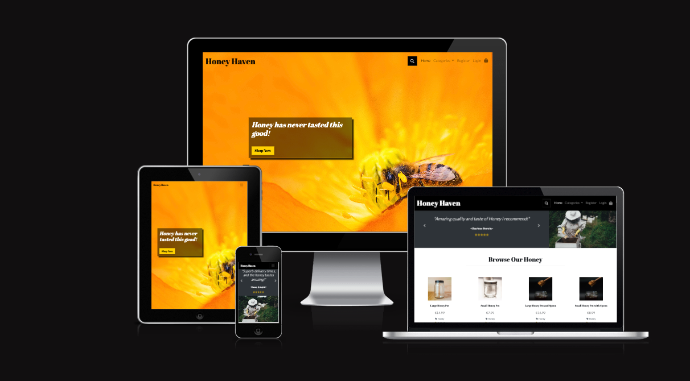
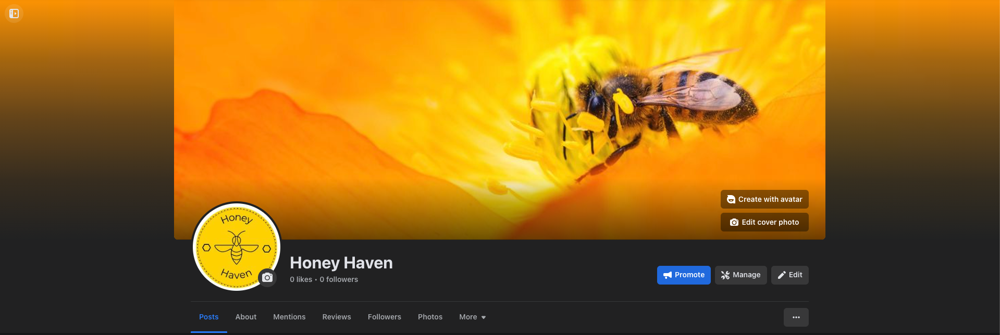
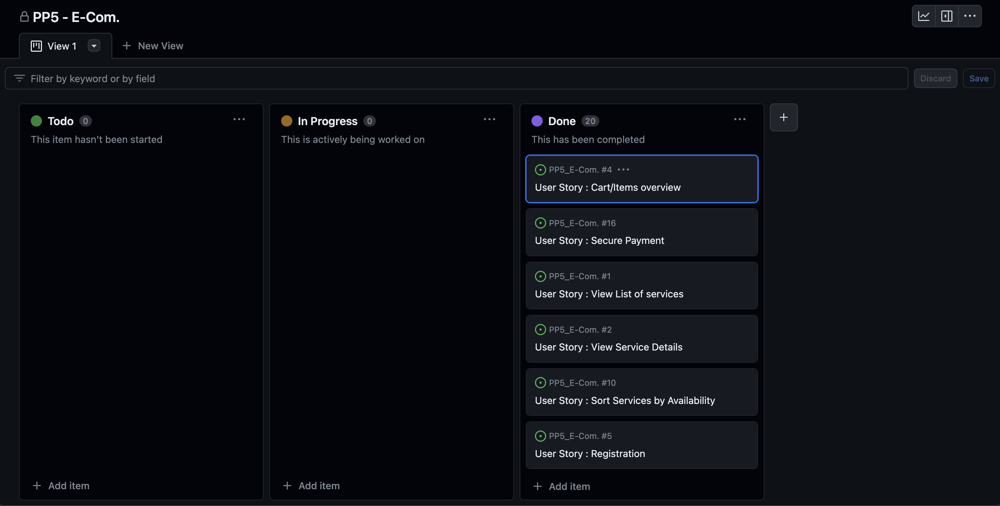
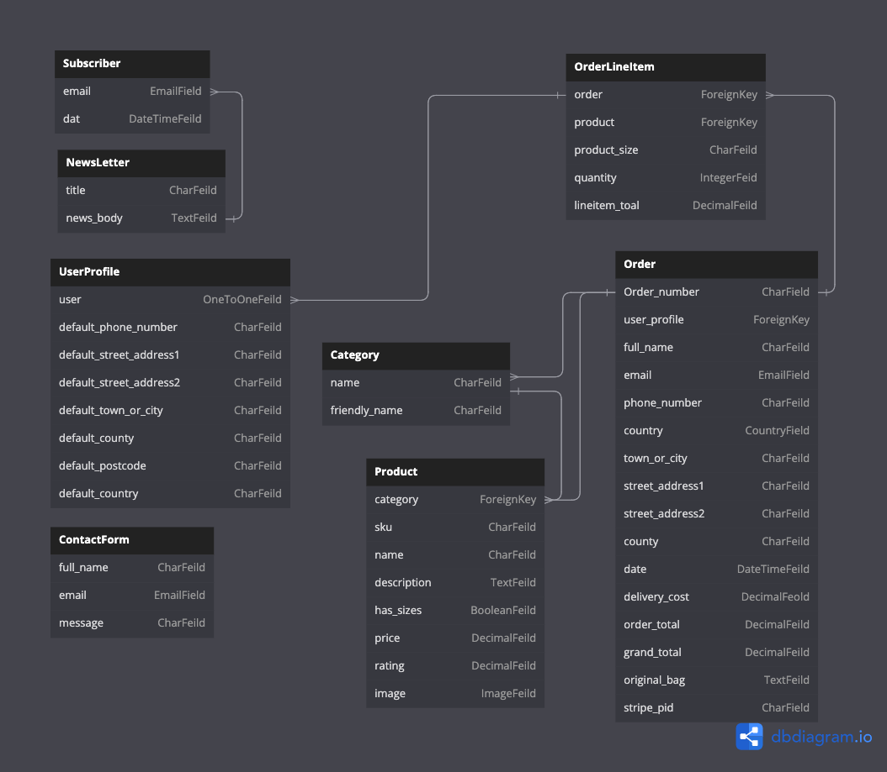
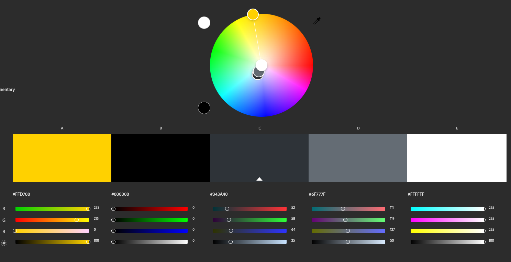

# Honey Haven

(Developer: Maksims Buraks)

[live web-page](https://honeyhaven-236ab8f8ceba.herokuapp.com/)

## Table of contents

- [Honey Haven](#honey-have)
  - [Table of contents](#table-of-contents)
  - [Project Overview](#project-overview)
  - [Business Model](#business-model)
  - [Project Goals](#project-goals)
    - [User Goals](#user-goals)
    - [Site Owner Goals](#site-owner-goals)
  - [User Experience](#user-experience)
    - [Target Audience](#target-audience)
    - [User Requirements and Expectations](#user-requirements-and-expectations)
    - [User Stories](#user-stories)
      - [First-time User](#first-time-user)
      - [Returning User](#returning-user)
      - [Site Owner](#site-owner)
  - [Design](#design)
    - [Design Choices](#design-choices)
    - [Kanban-Board](#kanban-board)
    - [Colour](#colour)
    - [Fonts](#fonts)
    - [Structure](#structure)
    - [Wireframes](#wireframes)
  - [Tech Used](#tech-used)
    - [Languages](#languages)
    - [Tools](#tools)
  - [Features](#features)
    - [Logo and Nav-Bar](#logo-and-nav-bar)
    - 
    - [Index](#index)
    - [Contact Form](#contact-form)
  - [Validation](#validation)
    - [HTML Validation](#html-validation)
    - [CSS Validation](#css-validation)
    - [Python Validation](#python-validation)
    - [JS Validation](#js-validation)
    - [Tests](#tests)
      - [Devices tested on on:](#devices-tested-on-on)
      - [Browser tested on on:](#browser-tested-on-on)
  - [Bugs](#Bugs)
  - [Deployment](#deployment)
  - [Future Features](#future-features)
  - [Credits](#credits)
    - [Media](#media)
    - [Code](#code)
  - [Acknowledgements](#acknowledgements)

## Project Overview

Welcome to Honey Haven, the one stop shop for everything related to natural honey as well as products! This project is essentially a proof of concept that will be worked on, and eventually become a fully fledged e-commerce store. Please note that while products at the moment are limited the end goal is to flesh it out once we determine exact products to be sold!

The website is a B2C and B2B model. It provides services to customers through shopping with a quick and easy pathway to purchase. User profiles display previous orders and the ability to save delivery info. The store also allows customers to subscribe to a news letter which in turn allows them to recieve emails updating them on new potential products and/or offers. There is a contact section that allows users to leave a message which will be displayed to the admin panel (future features will include a display of messages in the admin profile with a reply functionality)

Admins have the ability to edit/update and delete items. Full editing of the bag items for Users are also available.

SEO scores returned high through out as the keywords helped optimize them!

## Business Model

# Facebook Page

This project utilizes a facebook page to increase the clients reach and influence. It is based in cavan so the target audience would be local but through marketing it would allow to expand it's reach further in Ireland!

## Project Goals

### User Goals

    -Finding a site that provides ability to book a one on one session
    -To Create Bookings
    -To Update Bookings
    -To Delete Bookings
    -To Manage Bookings
    -To Create Account

### Site Owner Goals

    -Provide a simple and appealing manner in which to shop
    -Provide an area to get in contact
    -To manage and send news

## User Experience

### Target Audience

    -Honey enthusiasts local to Ireland

### User Requirements and Expectations

    -A simple and natural way to navigate the website
    -Quick acessibility to relevant information
    -Quick acessibility to relevant products
    -Appealing design that responds accordingly
    -User Subscribe functionality
    -Detail view of products
    -Login functionality in order to get in contact
    

### User Stories

#### User

#### Site Owner

5

## Design

### Design Choices

Website design was inspired by a variety of e-com websites, with the focus of the user having a clear goal. Every section is easy to understand, website flow is easy and navigation is intuative. Path to purchase is made as easy as possible

### Kanban-Board

A kanban board was utilised to set specific goals that would aid agile development! For a detailed view of my goals please find it following the link:
 
<a href="https://github.com/users/MaksimB96/projects/7">Kanban Overview</a>

### ER Diagram
Please find the Entity relationship diagram utilized to bring the project to fruition! The bulk of the logic happens between the user and products which ultimatley resuts in the order being placed. The contact form is a stand alone form that gets submitted to the admin panel which later a staff member will get in contact with. Subscription forms store info in the db which is then used by the admin via the admin news segment to send news to a list of emails.

### Colour

Colors used were the bootstrap bg dark with accents of grey and black and the main accent of yellow. These colors were chosen as all these tones play well together adding a layer of depth to the site while maintaining a minimal structure.
 

### Fonts

Fonts used were Abril Fatface with a fall back of cursive for the majority of headings as well as Lato with a fall back of sans-serif which I found complements the playful design of Abril and adds nice contrasts, as well as allowing users to quickly pick up on the vital points of info.

### Structure

The Structure of the website is clear and concise. Bright colors draw in the user, I untilised the rule of thirds on the home page to make the overall flow pleasant, as well as not over crowding areas with text. The aim was simple and clear, and specific towards an audience interested in honey produce. Navigation is intuative, and the path to purchase is simple and not cluttered.

 

The website is made up of multiple pages:

    -The Index
    -The Products
    -The Product Detail
    -The Bag
    -Checkout Area
    -Checkout Success
    -User Profile (If authenticated)
    -News Segment (If super User)
    -Edit/Add segemt (If super User)
    -Allauth essentials

### Wireframes

Index

Product View

Product Detail

Bag

Checkout

Profile

Admin Edit/Add

Admin News/Contact Form

Allauth all portals

## Tech Used

### Languages

    -HTML
    -CSS
    -Java Script
    -Pyhton
    -Django
    

### Tools

    -Git
    -Git Hub
    -Git Pod
    -Figma
    -Google Fonts
    -Adobe Color Wheel
    -Font Awesome
    -Favicon.io
    -Circle Crop
    -postgresql
    -psycopg
    -Canva
    -Boot strap 4
    -pixelr
    -Django
    -Crispy Forms
    -panda_io
    -Amazon Web Services

## Features

## Validation

### HTML Validation
W3C mark-up was utilised in order to validate html of the website. All Pages pass with no errors. It is worth noting that some pages with data_detail were thrown as errors which was not fixable

HTML

 

### CSS Validation
W3C CSS validator was utilised in order to make sure the css code passes standards with no errors.

Full Document

 

### Python Validation

CI Python linter used here to validate my views

Home

Products

Bag

Checkout

Contacts

Profiles

Subscription

### JS Validation
JSHint validator was utilised in order to make sure the javascript code passes standards with no errors or warnings, all functions return without errors!

 

### Performance

Below is the performance of all pages (note that performace was consistant across all pages with a high SEO):

Performance

### Tests

#### Devices tested on on:
    -Iphone SE, XR, 11, 12, 14, 14 pro, samsung s5
    -Ipad
    -Macbook Pro/Air
    -Lenovo Platform
    -Dell Platform

#### Browser tested on on:
    -Chrome
    -Safari
    -Brave/Brave Mobile

### Bugs

During Development I ran in to a few bugs:

  Media Files not fully rendering even with proper aws deployment:

  -This was fixed by implementing a media context proccessor.

  Sorting and some categories did not work

  -This was fixed by getting rid of the base js in the extended templates

  Codeanywhere workspaces deletion.

  -The cause of this was unknown, however thanks to Sean we migrated back to gitpod which was a more reliable IDE

  Contact form server error.

  -This was simply due to the db not being fully integrated

  Internal server error on deployed site

  -This was a typo in the products view for loop which I did not commit, site works fine now

3. Toast not

## Deployment

Honey Haven followed a multi-step deployment. The website was deployed as follows:

### GitHub

The process for github was as follows:
  -

## Future Features

There are a few more feartures that I would like to implement in the future. These Include:
1.User Unsubscribe functionality 
2.Rating System
3.Flesh out the products 
4.A Feedback Section/ Possibly rating system
5.Additional support through webkits for mozilla and other browsers

## Credits

### Media

Logo media created by me using  <a href="https://www.canva.com/">Canva</a>, this includes Icons and backgound images.
 
Any Icons used found on <a href="https://fontawesome.com/">Font Awesome</a>
 

# Images

1. Landing page - Kat Smith
2. HoneySpoon - Mae My
3. Spoon and honey - Daily Slowdown
4. Small Jar - Dario Menendez
5. Large Jar - Kier
6. Bee suit - gryffn
7. Lip Balm - Antoni Shkraba
8. Candle - Jill Burrow
9. Beeswax paper - Karina Zhukovskaya
10. Bee Flower - Erik Kartis

    
### Code 

1. Product/bag/checkout/search/wh handling logic inspired by : <a href="https://www.youtube.com/watch?v=3_3q_dE4_qs&t=649s">Code Institute Boutique Ado</a>
2. subscription form with my modifications by : <a href="https://www.youtube.com/watch?v=hWtlskOaFNI&t=3315s">KenBroTec</a>
3. Interactive search bar : <a href="https://bbbootstrap.com/snippets/expandable-search-bar-12368750">bbbootstrap</a>
4. Bootstrap Documentation
5. Django Documentation
6. Stripe Docs
7. 

## Acknowledgements

-I would like to thank my wonderful girfriend for the inspiration and idea conception, and for the slight scare at the hospital
 
-CI for provide me the knowledge to under-take this task
 
-Tutor Support for provideing better knowledge to implement the code and salvaging my project, especially Sean and Ed
 
-CI Boutique Ado for a solid foundation and logic behind e-commerce applications
 
-The wonderful community over on Slack!
<